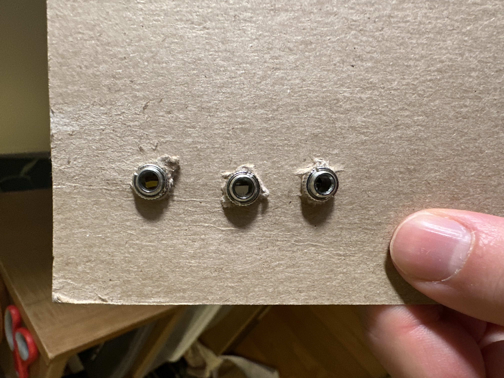

# Building a mult module for a modular synthesizer

## Introduction

In a [modular synthesizer](https://en.wikipedia.org/wiki/Modular_synthesizer), a multiplier module lets one signal control multiple parameters simultaneously. For example, a sine wave could control the both the cutoff of a filter and the pitch of a VCO. A clock signal could control the tempo of two sequencers.

With the help of a friendly and talented office floormate, and an [instructive and cool YouTube video](https://www.youtube.com/watch?v=sNT0mTsaOMg), I built a DIY one for my modular synthesizer.

 | | |
|-|-|
|  |

You can plug a signal into any one of the jacks, and then the three remaining jacks become outputs that you can use to control other signals in the synthesizer.

## Design and prototype

This design has a short parts list:

- 3 audio jacks
- Wires
- Front panel
- [Dymo](https://www.dymo.com/) label maker

The audio jacks each have three terminals: a ground terminal, and a left and right audio terminal. I wired together the ground terminals of each jack, and then the left and right terminals, first prototyping on a piece of cardboard:

 | | |
|-|-|
|  | |

## Final build

Then, my wonderful office floormate gave me a piece of aluminum to use as a front panel to replace the cardboard. It fit perfectly on the left side of my modular synth. We measured four equidistant drilling points on the panel, and used a drill press to drill 1/8th inch holes for the jacks. We also brushed the steel with a brush attachment on the press, which gave the panel a smooth look.

| | |
|-|-|
| |   |
| |   |
